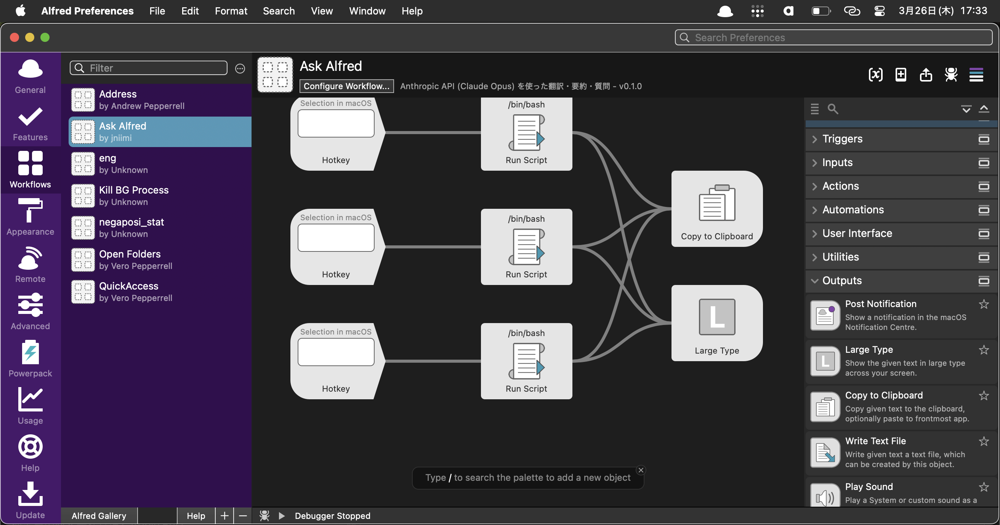
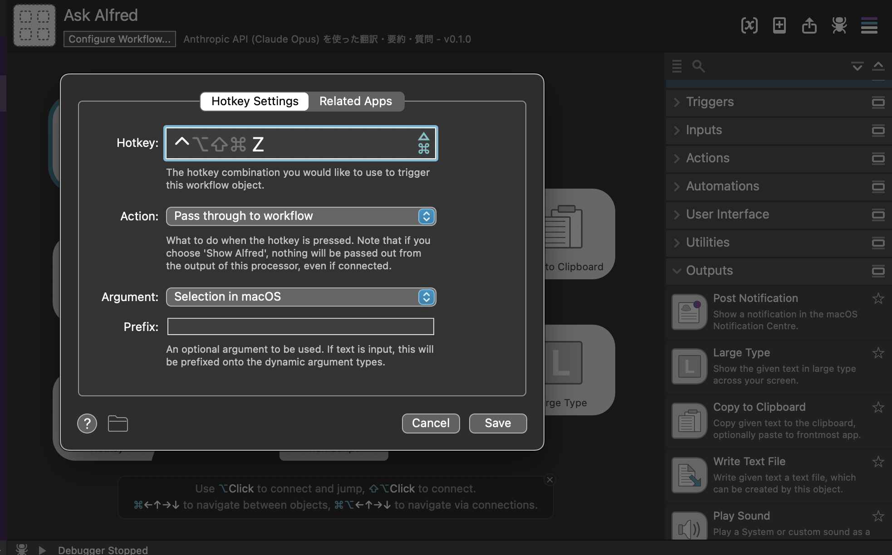
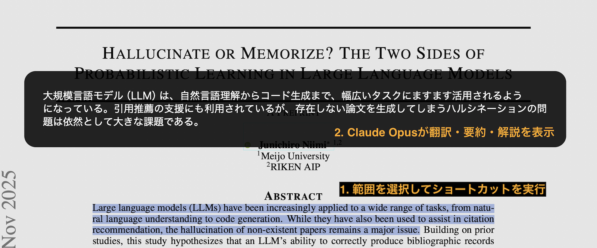

# Alfred Asks Claude

[](https://opensource.org/licenses/MIT) [](https://www.apple.com/macos/) [](https://www.anthropic.com/)

[Alfred](https://www.alfredapp.com/) Workflow で [Anthropic API](https://docs.anthropic.com/en/docs/about-claude/models) (Claude Opus) を使い、選択テキストの**翻訳**・**要約**・**解説**をワンアクションで行うツールです。

DeepL のショートカット翻訳のような体験を、LLM ベースでより柔軟に実現します。

[](https://github.com/jniimi/alfred-asks-claude/releases/download/v0.1.0/Alfred.Asks.Claude.alfredworkflow)

## 機能

| 機能 | 説明 |
|------|------|
| **翻訳** | 日本語 → 英語 / 英語 → 日本語 を自動判定して翻訳 |
| **要約** | 入力テキストを日本語で簡潔に要約 |
| **解説** | 入力テキストの内容を日本語で端的に解説 |

### 動作フロー

```
テキストを選択 → Hotkey → Anthropic API → Large Type で結果表示 + クリップボードにコピー
```

## セットアップ

### 1. 前提条件

- macOS
- [Alfred](https://www.alfredapp.com/) + [Powerpack](https://www.alfredapp.com/powerpack/)
- [Anthropic API キー](https://console.anthropic.com/)
- `jq`（`brew install jq` でインストール可能）

### 2. API キーを Keychain に登録

Alfred Asks Claude は API キーを macOS Keychain から読み取ります。環境変数や設定ファイルにキーを書く必要はありません。

ターミナルで以下を実行してください:

```bash
security add-generic-password -s "anthropic-api-key" -a "claude" -w "sk-ant-xxxxx..."
```

`sk-ant-xxxxx...` の部分を自分の API キーに置き換えてください。

正しく登録できたか確認するには:

```bash
security find-generic-password -s "anthropic-api-key" -a "claude" -w
```

### 3. Workflow のインストール

以下のボタンから `.alfredworkflow` をダウンロードし、ダブルクリックして Alfred にインポートしてください。

[](https://github.com/jniimi/alfred-asks-claude/releases/download/v0.1.0/Alfred.Asks.Claude.alfredworkflow)

または、リポジトリからビルドする場合:

```bash
git clone https://github.com/jniimi/alfred-asks-claude.git
cd ask-alfred
zsh install.sh
```

### 4. Hotkey の設定

インポート直後は Hotkey が未設定です。各 Hotkey ノードをダブルクリックして、好みのキーバインドを設定してください。



Hotkey 設定では以下を確認してください:

- **Hotkey**: 好みのキーの組み合わせを登録（例: `⌥+Z`, `⌥+X`, `⌥+C`）
- **Action**: `Pass through to workflow`
- **Argument**: `Selection in macOS`（必須）



## 使い方

1. 翻訳・要約・解説したいテキストを範囲選択し、設定したショートカットキーを実行
2. Claude Opus が翻訳・要約・解説の結果を Large Type で表示（同時にクリップボードにもコピーされます）



## 使用モデル・プライバシー

[Claude Opus](https://docs.anthropic.com/en/docs/about-claude/models) (`claude-opus-4-6`)

あくまでもAnthropicの公式API経由で推論を行うため、入出力されたデータが無断で学習に利用されることはありません。また、この Workflow 自体が独自にデータを収集することもありません。

## 作者

jniimi
- X: [@JvckAndersen](https://x.com/JvckAndersen)
- Website: [jniimilab.ai](https://jniimilab.ai)

## ライセンス

MIT License
